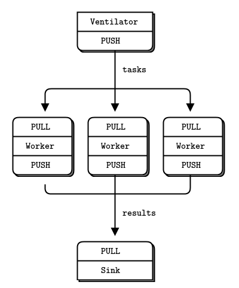

[WIP]

# Multilingual-Bert-as-a-service
### Quick start 
1. Create a virtual python environment with virtualenv  
`virtualenv env`
2. Activate the virtual environment 
`source env/bin/activate`
3. Run `python mbert_server/server_controller.py` to set up the MBert server. This will set up each component of the server architecture in their correct order (ventilator, worker, sink). 
3. Run `python mbert_client/mbert_client.py` to activate the client that feeds sentences to the service. 
4. Wait for the sink to collect results! 

### About the service 

The model server achitecture here implements the ventilator-worker-sink layout outlined in the [ZeroMQ docs](http://zguide.zeromq.org/page:all#Divide-and-Conquer).

In addition to this server architecture, there are also clients to push raw sentences to the server. These raw sentences have been processed by individual workers to return MBERT sentence encodings, which are subsequently gathered by the sink before being published back to the clients. 

I first came across this architecture when, while looking for ways to serve models in production, I read [Han Xiao's blogpost]( https://hanxiao.io/2019/01/02/Serving-Google-BERT-in-Production-using-Tensorflow-and-ZeroMQ/) on how he designed a fast and scalable way of serving BERT in production with Tensorflow and ZeroMQ. As outlined in the blog, the benefits of this design include: 

#### Decoupling of server and client 
- The MBERT model is decoupled from the downstream application clients. This means that the heavyweight model can be hosted on a separate process or more powerful GPU machine, while the downstream application clients, which tend to be more lightweight, can be run on a cheaper CPUs. There is also an added advantage: the client and server can be scaled separately as needed. "If feature extraction is the bottleneck, scale your GPU machines. If the downstream network is the bottleneck, add more CPU machines". [source](https://github.com/hanxiao/bert-as-service/issues/70)

#### PUSH-PULL and PUB-SUB sockets on the client
- By communicating with the ventilator via a PUSH-PULL system, the client does not have to send a request and wait for a response before sending the next request. The client is able to push several requests before receiving the results later. Additionally, because the client places data in a preset location to be picked up by the server, there does not need to be a constant connection between client and server. 

#### One-way flow of data through the pipeline 
- work is always sent downstream. There is no messaging upstream between receivers and senders. This flow "kills backchatter" to simplify how data flows through the system. 

#### Separated processes for the ventilator, workers and sink. 
Each component runs in its own process to simpligy message flow and make the logic of the system understandable.

### Other work:  
- [to serve GPT-2](https://medium.com/huggingface/scaling-a-massive-state-of-the-art-deep-learning-model-in-production-8277c5652d5f) as the autocomplete backend of their text editor app, Hugging Face implemented Gunicorn as a load balancer for individual workers. 
- informative discussion on the relative merits of ZMQ versus Tensorflow Serving from the [Bert-as-a-service github issues.](https://github.com/hanxiao/bert-as-service/issues/70)
- another informative blogpost about 

# The model and its applications  
## Multilingual BERT (M-BERT) [Devlin et.al](https://github.com/google-research/bert/blob/master/multilingual.md)
Companies with operations in multilple countries face the challenge of contextualising their services to the local context. An telecom operator, for instance, would need an automated customer FAQ system serving responses in multiple languages. It's not scalable to build a custom pipeline for each language / country, so multilingual models that can supposedly generalise across languages are attractive in this context. 

# Benchmark 
Dataset:XNLI dataset 
To provide sentence representations for the entire test set using a single REQ-REP architecture on a MacBook Pro 15 took 

# Follow-up 

